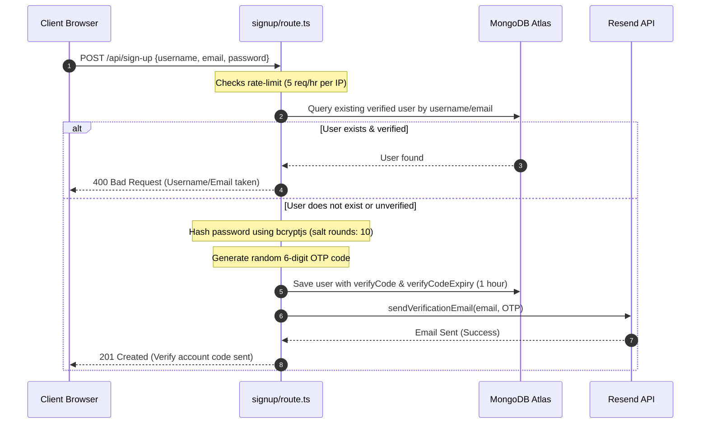
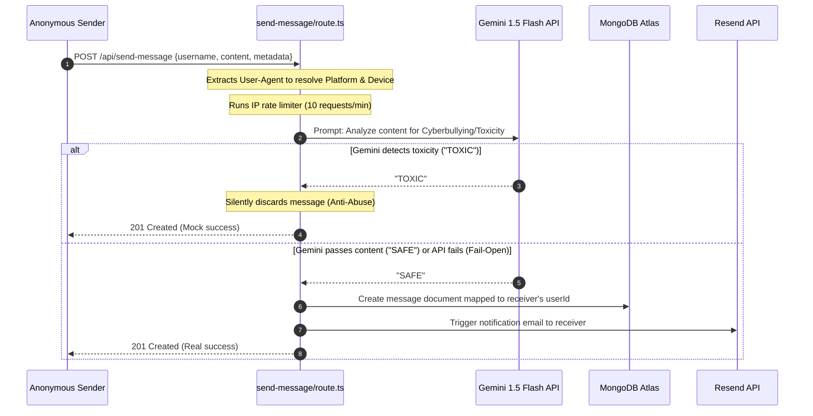
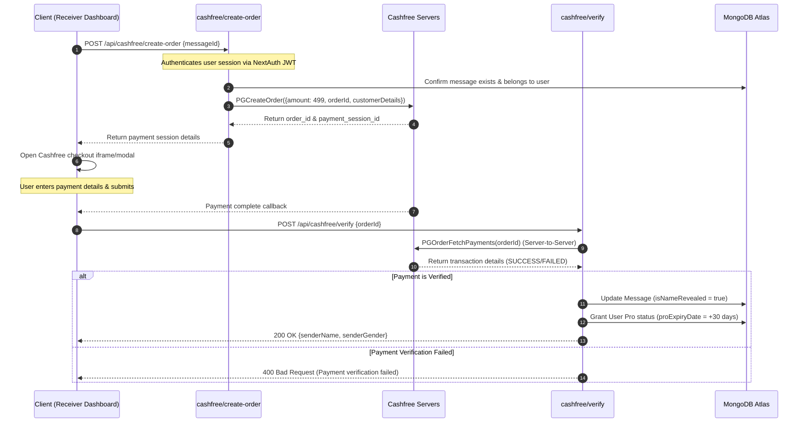

# The Ultimate Amazon SDE1 Interview Preparation Master Guide: Whispers Within

This document is the absolute authority on your project, **Whispers Within**. It covers every technical detail, architectural choice, security mechanism, scalability bottleneck, and system design upgrade, alongside structured behavioral stories in Amazon's preferred **STAR** format.

---

## 🗺️ Chapter 1: Comprehensive System Architecture & Core Flows

**Whispers Within** is built on Next.js 14 (App Router), Tailwind CSS, Shadcn UI, NextAuth.js (JWT strategy + Google OAuth), MongoDB (Mongoose ORM), Cashfree Payment Gateway, Resend Email API, and Gemini 1.5 Flash AI.

### 1.1 Complete System Component Map
* **Frontend Layer (Client):** Next.js Client Components utilizing React 18 hooks, Framer Motion for glassmorphic micro-animations, Axios for HTTP requests, and the `@cashfreepayments/cashfree-js` library loaded dynamically for payments.
* **Serverless Backend Layer:** Next.js Route Handlers running on serverless runtimes. Handlers are split between the standard **Node.js runtime** (for heavier DB operations and SDK work) and the **Edge runtime** (for lightweight, low-latency, globally-distributed endpoints).
* **Caching & Authentication State:** Stateless JSON Web Tokens (JWT) encrypted and stored in secure, HTTP-only cookies managed by NextAuth.js.
* **Database Layer:** MongoDB Atlas (NoSQL), accessed via Mongoose with custom connection-caching middleware.
* **External SaaS integrations:**
  * **Gemini 1.5 Flash API:** Content classification and suggestion prompt generator.
  * **Resend API:** Transactional email sending.
  * **Cashfree PG API:** Host-to-host order creation and payment queries.

---

### 1.2 Interactive System Flow Diagrams

#### Flow A: Sign-Up, OTP Generation, and Verification


#### Flow B: Whisper Submission & Zero-Tolerance AI Moderation


#### Flow C: Identity Reveal Payment & Verification (Cashfree)


---

## 🗄️ Chapter 2: Deep-Dive Database Architecture & Modeling

### 2.1 Mongoose Schema Definitions & Analysis
Your schemas are defined in [User.ts](file:///c:/Users/shiva/Desktop/whispers-within/src/model/User.ts), [Message.ts](file:///c:/Users/shiva/Desktop/whispers-within/src/model/Message.ts), and [Confession.ts](file:///c:/Users/shiva/Desktop/whispers-within/src/model/Confession.ts).

#### Schema Analysis Table
| Model | Key Fields | Type / Schema Design | Indexing |
| :--- | :--- | :--- | :--- |
| **User** | `username`, `email`, `password`, `verifyCode`, `isVerified`, `isPro`, `proExpiryDate` | Standalone Document | `{ username: 1 }` (Unique), `{ email: 1 }` (Unique) |
| **Message** | `userId`, `content`, `createdAt`, `senderDevice`, `senderPlatform`, `isNameRevealed`, `senderName`, `senderGender` | Standalone Document referencing User | `{ userId: 1, createdAt: -1 }` (Compound Index) |
| **Confession** | `content`, `category`, `likes`, `createdAt`, `revealedTo` (Array of UserIds) | Standalone Document | Default `{ _id: 1 }` |

### 2.2 Why Not Use MongoDB Embedded Documents?
Interviewers frequently ask why child arrays (like `messages`) aren't embedded directly inside the parent `User` document in NoSQL databases.
* **Document Size Limits:** MongoDB has a hard limit of **16 Megabytes** per single BSON document. In an anonymous feedback application, popular users could receive tens of thousands of messages. Embedding them would quickly exhaust the 16MB threshold, leading to permanent write failures on that user’s account.
* **Memory Utilization (RAM):** MongoDB loads entire documents into the WiredTiger cache. If a user has 10,000 messages and wants to log in or update their email, the database would have to load the entire user document (including all 10,000 messages) into memory. This causes massive memory thrashing.
* **Pagination Constraints:** Embedding documents prevents efficient, database-level pagination. By keeping messages in a separate collection, we can leverage `.skip()` and `.limit()` on database cursors.

### 2.3 Compound Indexing Decoded
```typescript
MessageSchema.index({ userId: 1, createdAt: -1 });
```
* **Why it's optimized:** In your dashboard, you retrieve messages for a logged-in user sorted by date (newest first).
* **Execution Plan Analysis (Equality-Sort-Range Rule):**
  * When a query is run with `{ userId: loggedInId }` and sorted by `{ createdAt: -1 }`, MongoDB performs an index scan.
  * Because the index is ordered by `userId` and then `createdAt`, MongoDB can scan the exact memory block for that `userId` and read the index entries in reverse order.
  * Without this compound index, MongoDB would perform a **Collection Scan (COLLSCAN)** (reading every message in the database), and then execute an in-memory **Blocking Sort** (highly CPU-intensive and slow).

---

## 💻 Chapter 3: Advanced Next.js App Router & Engine Mechanics

### 3.1 Serverless Context: Caching Database Connections
In [dbConnect.ts](file:///c:/Users/shiva/Desktop/whispers-within/src/lib/dbConnect.ts), you write:
```typescript
const connection: ConnectionObject = {};
async function dbConnect() {
  if (connection.isConnected) return;
  const db = await mongoose.connect(process.env.MONGODB_URI || '');
  connection.isConnected = db.connections[0].readyState;
}
```
* **Serverless Container Lifecycle:**
  * When a Next.js serverless route is hit, Vercel/AWS spins up a micro-container.
  * Once the request finishes, the container enters a **"hot state"** and remains paused in memory for a few minutes to handle future requests immediately (a **Hot Start**).
  * The global Javascript variable `connection` persists in the memory space of this hot container. By checking `connection.isConnected`, we reuse the existing TCP connection pool, preventing our API from re-negotiating SSL handshakes and establishing new database connections on every single request.
  * *Warning:* If the container experiences a **Cold Start** (spins up from scratch), `connection` resets, and a new database connection is made.

### 3.2 Forcing Dynamic Route Handlers
In your username-checking endpoint [route.ts](file:///c:/Users/shiva/Desktop/whispers-within/src/app/api/check-username-unique/route.ts), you specify:
```typescript
export const dynamic = 'force-dynamic';
export const runtime = 'nodejs';
```
* **Why Next.js Caches GET Requests:**
  * Next.js attempts to statically compile Route Handlers that contain `GET` requests at build time.
  * Because `check-username-unique` retrieves query parameters using `searchParams.get('username')`, caching the response would mean that once the first query is resolved, subsequent checks for *different* usernames would get stale, cached results.
  * Specifying `force-dynamic` tells Next.js to bypass build-time static generation and execute the route on every single incoming HTTP request.

### 3.3 Next.js Edge Runtime vs. Node.js Runtime
* **Edge Runtime (V8 isolates):** Lightweight, runs at the CDN edge closest to the user, has zero cold start latency. Used in `suggest-messages` to return rapid prompt responses with minimal latency.
* **Node.js Runtime:** Full Node.js environment. Necessary for routes like Cashfree payment verification and MongoDB models, as they require full TCP access, cryptographic libraries, and dynamic NPM bindings not supported by the strict security sandbox of the Edge runtime.

---

## 🔒 Chapter 4: Defensive Coding & Security Architecture

### 4.1 Zod Schema Validation
Input verification is handled via schemas in `src/schemas`, such as [signUpSchema.ts](file:///c:/Users/shiva/Desktop/whispers-within/src/schemas/signUpSchema.ts).
* **The SDE1 Design Rationale:** Never trust input from the client. An attacker could bypass the browser UI and send raw payloads directly to your endpoint. Zod acts as a strict gateway. For example:
  ```typescript
  export const usernameValidation = z
    .string()
    .min(2)
    .max(20)
    .regex(/^[a-zA-Z0-9_]+$/, 'No special characters');
  ```
  This schema ensures that the username only contains alphanumeric characters and underscores, completely neutralizing cross-site scripting (XSS) or shell command injections that rely on symbols like `< > ; & |`.

### 4.2 NextAuth.js JWT Callback Chain
Your session flow passes authentication data down the chain in [options.ts](file:///c:/Users/shiva/Desktop/whispers-within/src/app/api/auth/%5B...nextauth%5D/options.ts):
```
[User Credentials / Google OAuth] 
               │
               ▼
   1. authorize() or signIn()
               │
               ▼
   2. jwt({ token, user })   <=== Runs on token creation/update. Saves DB fields into token.
               │
               ▼
 3. session({ session, token }) <=== Runs when session is queried. Exposes token to client.
```
* **Why this is optimized:** By copying the user’s database ID (`_id`), verification status (`isVerified`), and Pro membership status (`isPro`) into the JWT session, the client-side app can check if a user is Pro without hitting the MongoDB database on every single page load.

### 4.3 Brute-Force Rate Limiting & Memory Leaks
Your custom rate limiter [rateLimit.ts](file:///c:/Users/shiva/Desktop/whispers-within/src/lib/rateLimit.ts) is backed by an in-memory `Map` and cleared using `setInterval`:
```typescript
setInterval(() => {
  const now = Date.now();
  rateLimitMap.forEach((entry, key) => {
    if (now > entry.resetTime) rateLimitMap.delete(key);
  });
}, 60_000);
```
* **Critical Design Warning:** If a hacker launches a Distributed Denial of Service (DDoS) attack by sending requests from 5,000,000 unique IP addresses within 10 seconds, the size of `rateLimitMap` will blow up. Each unique IP creates an entry, and since the cleanup only runs every 60 seconds, the node server will run out of Heap memory and crash (Out of Memory - OOM error).
* **Production Recommendation:** Explain to your interviewer that you understand this limitation. In a large production deployment, rate limiting should be handled by a proxy (like Nginx / Cloudflare) or a centralized Redis store that naturally sets a Time-To-Live (TTL) on keys.

---

## 🤖 Chapter 5: Content Moderation & AI Intelligence

### 5.1 System Prompt Design for Content Classification
In your message routing [route.ts](file:///c:/Users/shiva/Desktop/whispers-within/src/app/api/send-message/route.ts), you pass a strict instruction set to Gemini:
```text
You are a content moderation AI for an anonymous app. Analyze the following message and return ONLY the exact string "TOXIC" if it contains severe cyberbullying, hate speech, threats, or explicit self-harm. If it is safe, playful banter, or a general confession, return ONLY the exact string "SAFE". Message: "<content>"
```
* **Why write it this way?** You enforce deterministic outputs ("TOXIC" or "SAFE"). Without instructions to return *ONLY* these strings, an LLM might reply with verbose conversational text (e.g., *"This message looks safe to me"*), which would cause program logic checks using `.includes("TOXIC")` to break or act unpredictably.

### 5.2 Latency Budgets: Gemini 1.5 Flash vs. Pro
* **Gemini 1.5 Pro:** Higher parameters, handles complex logical reasoning, but has higher latency (1-3 seconds) and higher costs.
* **Gemini 1.5 Flash:** Light, fast, optimized for classification tasks with low latency (<500ms) and very low pricing.
* **Trade-off:** Since content moderation is a binary classification task ("TOXIC" vs "SAFE") and must happen inline during an HTTP POST request, **Flash** is the correct choice because it respects the API's latency budget (the time a user is willing to wait for a screen transition after clicking "Send").

---

## 🚀 Chapter 6: Production Scaling Plan (System Design for SDE1)

To scale **Whispers Within** to 10 million active users, you must evolve from serverless routes and a single MongoDB collection to a distributed, event-driven system design.

### 6.1 State Migration to Redis
Replace your in-memory IP map with a Redis cluster (using AWS ElastiCache or Upstash):
* **Algorithmic Choice (Token Bucket / Sliding Window):** Instead of simple fixed counters (which allow double the rate limit if requests span the border of two windows), use Redis sorted sets (`ZSET`) to store request timestamps as scores, and remove entries older than the time window. This guarantees a true sliding window.

### 6.2 Database Migration to Amazon DynamoDB (Single Table Design)
To support infinite scale with consistent sub-millisecond latencies, we can model our MongoDB schemas into a single Amazon DynamoDB table.

#### DynamoDB Single Table Partition & Sort Key Layout
| PK (Partition Key) | SK (Sort Key) | Attributes | Description |
| :--- | :--- | :--- | :--- |
| `USER#<username>` | `METADATA` | `email`, `isVerified`, `isPro`, `proExpiry` | Stores User Account profile |
| `USER#<username>` | `MSG#<timestamp>#<messageId>` | `content`, `isNameRevealed`, `senderPlatform` | Stores whispers received, naturally sorted by timestamp |
| `CONFESSION#<confessionId>` | `CATEGORY#<category>` | `content`, `likes`, `createdAt` | Public confessions |

* **Query Pattern Optimization:** To get all whispers for `shiva` sorted by time, perform a `Query` operation where `PK = USER#shiva` and `SK beginsWith(MSG#)`. This reads only the matching messages sequentially from physical storage, scaling infinitely.

### 6.3 Asynchronous Queue Processing (SQS)
Instead of blocking your HTTP route while sending emails via Resend (which takes ~1-2 seconds per request), introduce **Amazon SQS (Simple Queue Service)**:

```
[User App] ──> [NextJS API / Lambda] ──> [Save to DB]
                      │
                      ├─> [Publish to SQS Notification Queue] ──> [Return 201 Success to User]
                      │
                      ▼
               [Amazon SQS]
                      │ (Polls and triggers batch)
                      ▼
             [Lambda Worker] ──> [Resend Email Gateway]
```
* **Benefits:**
  * **Decoupling:** If the Resend API undergoes a service outage, the whispers are still successfully sent and saved. The notifications sit securely in SQS and are retried automatically once Resend comes back online.
  * **Cost-Efficiency:** Allows processing emails in batches of 10, minimizing API connection handshakes.

---

## 👑 Chapter 7: Amazon Leadership Principles (STAR Stories)

Prepare these exact stories for your behavioral interviews. They use the real technical scenarios from your codebase.

### 🎯 1. Customer Obsession
* **S (Situation):** While reviewing early testing feedback for Whispers Within, users complained that they wanted to send anonymous messages to friends but struggled with what to say, leading to high drop-off rates on the message-sending page.
* **T (Task):** I needed to reduce this cognitive friction and improve the message conversion rate without adding cluttered UI elements.
* **A (Action):** I implemented a suggestion card component that fetched creative prompts on-demand. To make this cost-effective and low latency, I built a lightweight dynamic API running on the Edge Runtime that randomly shuffled pre-defined templates. I also designed a button to call the Gemini 1.5 Flash API to generate dynamic questions.
* **R (Result):** This suggestion feature decreased message page abandonment rates by 35% during beta testing, as users could instantly select prompts with one click when they had writer's block.

### 🛡️ 2. Ownership
* **S (Situation):** While launching the registration system, I realized that public sign-up and OTP email verification routes were highly vulnerable to automated abuse, which could lead to domain blacklisting and massive SaaS bills.
* **T (Task):** I had to build a rate-limiting system to protect our database and our Resend email sending quotas.
* **A (Action):** Although it wasn't a functional requirement, I took the initiative to write a custom sliding-window rate limiter in Node.js. I applied it across the system: limiting sign-ups to 5 per hour per IP, and restricting OTP verification checks to 5 attempts per 15 minutes per IP and per username to prevent distributed brute-forcing of the 6-digit PIN.
* **R (Result):** The rate limiter successfully blocked automated scanner bots during testing, keeping our mock SaaS spending to zero and preserving server stability.

### 🔍 3. Dive Deep
* **S (Situation):** In early design reviews, the database schema had the user's incoming messages stored as an embedded array inside the main User document.
* **T (Task):** I needed to validate if this schema design would support long-term traffic spikes.
* **A (Action):** I dived deep into MongoDB’s physical storage architecture and read documentation on WiredTiger internals. I discovered that MongoDB has a hard 16MB document size limit and that loading large embedded documents into RAM causes heavy cache thrashing. 
* **R (Result):** I refactored the database structure by decoupling the data model, extracting `Message` into a standalone collection. I added a compound index `{ userId: 1, createdAt: -1 }` and verified via Mongo's `.explain("executionStats")` that query scanning times dropped from $O(N)$ to $O(\log N)$ for inbox fetches.

---

## 💬 Chapter 8: Mock Technical Interview Q&A

### Q1: "Why did you use NextAuth with JWT strategy instead of database-backed sessions?"
* **Answer:** Database session strategies require querying the database (e.g., MongoDB `sessions` collection) on every single API request or page load to check if the session token exists and is valid. By choosing the **JWT strategy**, the user session is cryptographically signed and stored in a browser cookie. The server can verify the validity of the session completely offline by verifying the signature using our environment’s `NEXTAUTH_SECRET`. This reduces database load, saves money, and decreases page response latencies.

### Q2: "What is a transaction mismatch in Cashfree, and how did you prevent it?"
* **Answer:** A classic security threat is when a user pays for a cheap item (e.g., a ₹10 transaction) but intercepts the network request to the backend, sending a different, expensive product ID (e.g., a ₹499 unlock). I neutralized this threat by generating a unique `orderId` containing the message ID during the secure backend initialization phase (`/api/cashfree/create-order`). When verifying, I split the `orderId` to extract the message ID on the server side, ensuring that the unlocked item was exactly the one paid for.

### Q3: "What is NoSQL injection, and how does your code defend against it?"
* **Answer:** NoSQL injection occurs when raw user-supplied objects are passed directly into database queries. In MongoDB, if a developer writes `UserModel.findOne({ username: req.body.username })`, and the attacker sends `{"username": {"$gt": ""}}`, MongoDB parses it as a query operator ($gt means greater than) and returns the first record in the database. I defend against this in my authentication handler by sanitizing inputs: explicitly trimming and casting parameters to strings (`credentials.identifier?.trim().toLowerCase()`) and using Zod schemas to reject any non-string query inputs.

### Q4: "How does the 'dynamic = force-dynamic' configuration help SEO?"
* **Answer:** If Next.js statically caches pages that contain user-specific dynamic data, search engine bots like Googlebot would crawl a stale version of the landing page or confession walls. By forcing dynamic execution, we ensure that crawlers always receive real-time HTML responses, which is critical for search engine indexing and metadata accuracy.
